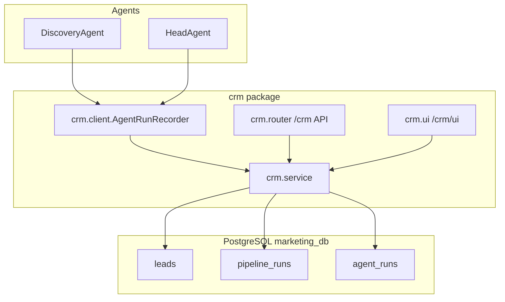

# Department CRM subproject (module now, service later)

## Goal

Build a **simple, structured CRM** that:
- Stores **leads** and their lifecycle (`raw` → `categorized` → …) using the existing schema in [`db/models.py`](db/models.py)
- Records **every agent execution** with inputs, outputs, status, duration, and **APIs consumed** (DDG, LiteLLM, LM Studio model alias, etc.)
- Exposes a **REST API** under `/crm/*` on the current app (port **8000**)
- Provides a **minimal read-only UI** (leads list + agent run log)
- Is **documented** (creation process, schema, API reference, agent integration contract)
- Is structured so it can later become a **standalone Docker service** on port 8001 without rewriting business logic



---

## What already exists (reuse, don’t duplicate)

| Asset | Location | Reuse |
|-------|----------|--------|
| Lead / Outreach / TaskLog models | [`db/models.py`](db/models.py) | Keep `Lead`; extend tracing beyond minimal `TaskLog` |
| CRM writes | [`tools/crm_tool.py`](tools/crm_tool.py) | Agents keep using this for lead I/O short-term; CRM service wraps same tables |
| Postgres | `docker-compose` `marketing_postgres` | Same DB, same Alembic |
| FastAPI shell | [`api/main.py`](api/main.py) | Mount CRM router here |

**Gap today:** Discovery/Head return JSON/markdown but **do not persist leads** or **structured agent run records** (only manual `crm_tool` tests hit the DB).

---

## Folder layout (extractable later)

```
crm/
  __init__.py
  schemas.py          # Pydantic request/response DTOs
  service.py          # Business logic (no FastAPI imports)
  router.py           # REST /crm/*
  ui.py               # GET /crm/ui/* (Jinja2 HTML)
  client.py           # AgentRunRecorder — in-process today, HTTP adapter later
  templates/
    base.html
    leads.html
    runs.html
    run_detail.html
docs/crm/
  README.md           # Creation process + architecture
  API.md              # Endpoint reference + examples
  AGENT_INTEGRATION.md# How each agent logs runs + APIs consumed
  SCHEMA.md           # Tables, enums, growth path
```

**Extraction rule:** `crm/service.py` + `crm/schemas.py` have **zero** imports from `agents/` or `workflows/`. Only `agents/` and `workflows/` import `crm.client`. Later: add `crm/http_client.py` and a `crm` Docker service that imports the same `service.py`.

---

## Database additions (Alembic migration)

New tables (complement existing `task_log`; keep `task_log` for backward compatibility):

### `pipeline_runs`
One row per end-to-end test/pipeline invocation.

| Column | Purpose |
|--------|---------|
| `id` UUID | Run id |
| `trigger` | e.g. `api`, `cli`, `pytest` |
| `seed_query` | Discovery seed |
| `status` | `running` / `success` / `failed` |
| `started_at`, `finished_at` | Timing |
| `meta` JSON | Docker env, model aliases snapshot |

### `agent_runs`
One row per agent step (Discovery, Head, future Categorization, …).

| Column | Purpose |
|--------|---------|
| `id` UUID | |
| `pipeline_run_id` FK | Links to pipeline |
| `agent_name` | `discovery`, `head`, … |
| `model` | LiteLLM alias used (`discovery-model`, `head-model`) |
| `status` | `running` / `success` / `failed` |
| `input_summary` TEXT | Short human-readable input |
| `output_summary` TEXT | Short output (or truncated markdown) |
| `output_json` JSON | Full structured payload (search hits count, etc.) |
| `apis_consumed` JSON | **Technical trace** — e.g. `[{"name":"ddgs","type":"web_search"},{"name":"litellm","model":"discovery-model"}]` |
| `records_processed` INT | Leads touched |
| `error_message` TEXT | On failure |
| `started_at`, `finished_at` | |

### `lead_events` (optional but recommended for growth)
Audit trail: which agent changed what.

| Column | Purpose |
|--------|---------|
| `lead_id` FK | |
| `agent_run_id` FK | |
| `event_type` | `created`, `status_changed`, `field_updated` |
| `payload` JSON | `{field, old, new}` |

Add SQLAlchemy models in [`db/models.py`](db/models.py) + migration `migrations/versions/20260711_0002_crm_agent_runs.py`.

---

## REST API (`/crm/*`)

Mount in [`api/main.py`](api/main.py): `app.include_router(crm_router, prefix="/crm")`.

| Method | Path | Purpose |
|--------|------|---------|
| GET | `/crm/health` | CRM module health |
| GET | `/crm/leads` | List leads (`?status=raw&limit=50`) |
| GET | `/crm/leads/{id}` | Lead detail + recent `lead_events` |
| POST | `/crm/leads` | Create lead (agents / tools) |
| PATCH | `/crm/leads/{id}` | Update lead fields / status |
| POST | `/crm/pipeline-runs` | Start pipeline run |
| PATCH | `/crm/pipeline-runs/{id}` | Complete pipeline run |
| POST | `/crm/agent-runs` | Start agent run |
| PATCH | `/crm/agent-runs/{id}` | Complete with output + `apis_consumed` |
| GET | `/crm/agent-runs` | List runs (`?agent_name=discovery&pipeline_run_id=`) |
| GET | `/crm/agent-runs/{id}` | Run detail |

OpenAPI auto-docs at `/docs` (existing FastAPI).

---

## Minimal UI (read-only)

Routes in `crm/ui.py` (server-rendered **Jinja2** — no React build step):

| URL | Page |
|-----|------|
| `/crm/ui` | Redirect to leads |
| `/crm/ui/leads` | Table: name, url, status, source, lead_score, updated_at |
| `/crm/ui/runs` | Table: pipeline_run, agent_name, model, status, duration, APIs |
| `/crm/ui/runs/{id}` | Detail: input/output summary, JSON output, linked leads |

Add `jinja2` to [`requirements.txt`](requirements.txt).

---

## Agent integration (first wiring)

### `crm/client.py` — `AgentRunRecorder`

Context-manager style used by agents:

```python
with recorder.agent_run("discovery", model=self.model, input_summary=seed_query) as run:
    run.record_api("ddgs", "web_search")
    raw = web_search_tool(...)
    run.record_api("litellm", "chat", model=self.model)
    report = lm_client.chat_completion(...)
    # persist leads from search results
    for hit in raw:
        lead_id = service.create_lead_from_search_hit(hit, agent_run_id=run.id)
    run.set_output(summary=report[:500], json={...})
```

### Wire into existing agents

1. [`workflows/main_pipeline.py`](workflows/main_pipeline.py) — create `pipeline_run` at start; close on success/failure
2. [`agents/discovery_agent.py`](agents/discovery_agent.py) — agent_run + **insert leads** from `search_results` (`name`←title, `url`, `status=raw`, `source=discovery`)
3. [`agents/head_agent.py`](agents/head_agent.py) — agent_run + log LiteLLM call; attach `output_summary` (head markdown)

### Refactor path for `crm_tool.py`

- Short term: `crm/service.py` calls same SQL patterns as [`tools/crm_tool.py`](tools/crm_tool.py)
- `tools/crm_tool.py` becomes thin wrapper delegating to `crm.service` (agents unchanged)
- Future: `tools/crm_tool.py` calls `CRM_HTTP_CLIENT` when `CRM_BASE_URL` env is set (extracted service)

---

## Documentation deliverables

Create under `docs/crm/`:

| Doc | Contents |
|-----|----------|
| **README.md** | Why CRM exists, module-vs-service strategy, how to run locally/Docker |
| **SCHEMA.md** | ER diagram (mermaid), table fields, lead status enum, growth checklist |
| **API.md** | Every endpoint, request/response examples, curl + `docker compose exec` examples |
| **AGENT_INTEGRATION.md** | Per-agent contract: what to log, `apis_consumed` schema, lead write rules |
| **CREATION_LOG.md** | Step-by-step build log (append to [`logs/EXECUTION_PROGRESS.txt`](logs/EXECUTION_PROGRESS.txt) on completion) |

Update [`TECHNICAL_IMPLEMENTATION_TRACKER.md`](TECHNICAL_IMPLEMENTATION_TRACKER.md) with CRM phase checklist.

---

## Verification (real, no mocks)

1. `alembic upgrade head` in `app` container
2. Run pipeline: `docker compose exec app python scripts/real_verification.py --pipeline`
3. Assert via API/UI:
   - `GET /crm/agent-runs` shows `discovery` + `head` rows with `apis_consumed`
   - `GET /crm/leads?status=raw` shows leads from search hits
   - `/crm/ui/runs` renders in browser
4. Add `tests/test_crm_api.py` — real Postgres when `DATABASE_URL` set (same pattern as [`tests/test_db.py`](tests/test_db.py))

---

## Out of scope (later phases)

- Separate `crm` Docker service on port 8001 (structure supports it; not in this pass)
- Full CRM UI (edit leads, filters, auth)
- Categorization/Analysis agent wiring (document placeholders in AGENT_INTEGRATION.md)
- Site DB / Render sync (Phase F)

---

## Implementation order

1. Migration + models (`pipeline_runs`, `agent_runs`, `lead_events`)
2. `crm/service.py` + `crm/schemas.py`
3. `crm/router.py` + mount in `api/main.py`
4. `crm/client.py` + wire `main_pipeline`, `discovery_agent`, `head_agent`
5. `crm/ui.py` + templates
6. `docs/crm/*` + tracker/progress updates
7. `tests/test_crm_api.py` + live pipeline verification
